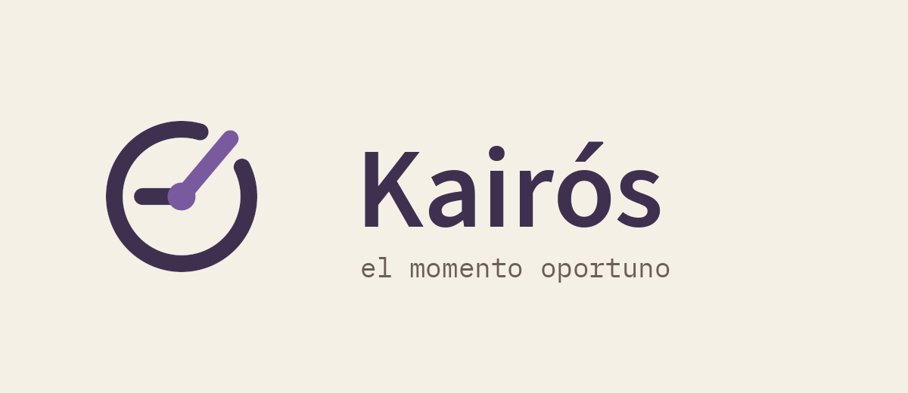
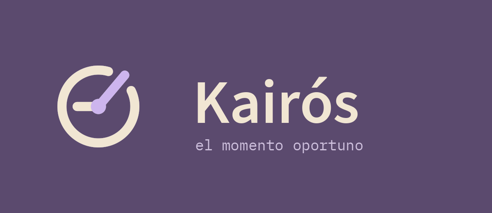
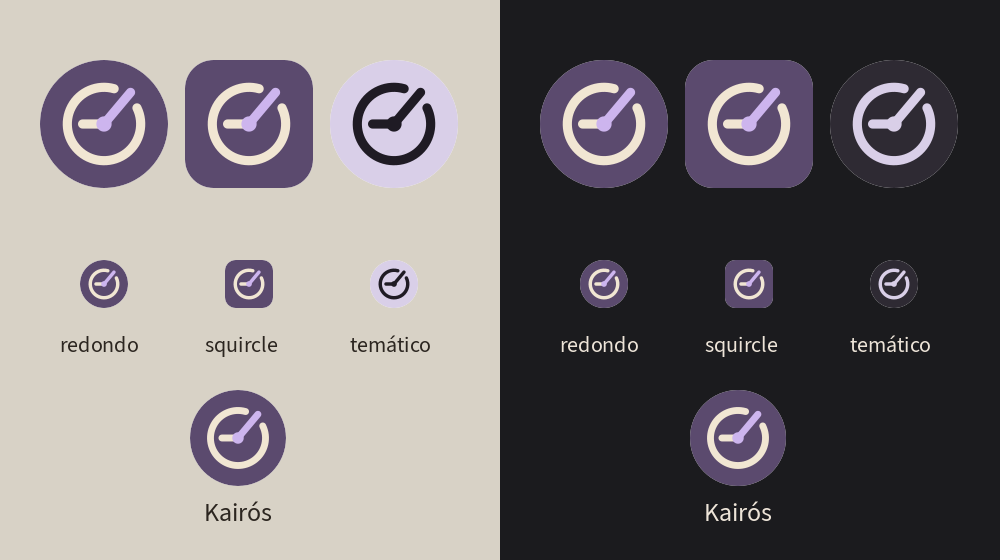

# Logo de Kairós

## Concepto: la rendija

Una **esfera de reloj abierta**: al anillo le falta un tramo hacia la 1:40 y el
**minutero sale justo por ese hueco**; el horario marca las 9. Kairós es el
momento oportuno, la rendija por la que hay que pasar a tiempo (salir hacia
algo). El anillo es también el monóculo de Erizógenes morado. Es el concepto
`7-ventana-elegido`.

### Por qué este y no los otros (`conceptos/`, hoja en `conceptos/hoja-conceptos.png`)

| Concepto | Qué pasó |
|---|---|
| 1 · arco solar con aguja | Amanecer genérico; a 48 px los rayos se empastan. |
| 2 · K con manecilla / 3 · K-reloj | Se lee la K, pero la K en un círculo recuerda demasiado a una marca conocida de tiendas y el reloj casi no se nota. |
| 4 · monóculo-reloj con cordón | El cordón convierte el monóculo en una lupa o una Q (ícono de buscar). |
| 5 · esfera con marcas | Reloj de clipart. |
| 6 · rendija sin horario | Limpio, pero se lee como velocímetro. |
| **7 · rendija con horario** | **Elegido.** El horario lo vuelve reloj sin ambigüedad, el hueco lo hace propio, y comparte anillo con Cátedra. |

## Construcción

- Rejilla de **108**, centro (54,54), el **mismo anillo que Cátedra**: radio 24,
  trazo 6, remates redondos.
- Hueco de **48°** centrado en **−50°** (la 1:40).
- Minutero: del centro a radio 27 a −50°, cruza el hueco y asoma apenas.
- Horario: del centro 14 unidades hacia la izquierda (las 9).
- Eje: punto de radio 5 en el color de acento.
- En el lanzador el símbolo se reduce a **0,86**, igual que Cátedra.

## Colores

| Uso | Oscuro (lanzador) | Claro (papel) |
|---|---|---|
| Fondo | ciruela `#5B4A6E` (Erizógenes morado) | papel `#F5F0E6` |
| Anillo y horario | hueso `#F1E6D3` | ciruela oscuro `#3E3150` |
| Minutero y eje | lila `#CDB5EE` | violeta `#7A5A9E` |

Cátedra y Kairós comparten el hueso y el papel; cambia el fondo (tinta ↔
ciruela) y el acento (ocre ↔ lila). Monocromo (`logo-mono.svg`, capa temática
de Android 13 e ícono de notificación): todo en un solo color.

## Archivos

- `logo.svg` — ícono con fondo (squircle). `logo-transparente.svg` — símbolo sin fondo, colores claros. `logo-mono.svg` — un color.
- `preview-claro.png`, `preview-oscuro.png`, `preview-lanzador.png`.
- `generar.py` — genera todo lo anterior y los recursos Android:
  `drawable/ic_launcher_foreground.xml`, `drawable/ic_launcher_monochrome.xml`,
  `mipmap-anydpi-v26/ic_launcher{,_round}.xml`, `values/ic_launcher_colors.xml`,
  `mipmap-*/ic_launcher{,_round}.png` y `drawable/ic_stat_kairos.xml`.
  Uso: `python3 design/logo/generar.py` desde la raíz (necesita `rsvg-convert` y Pillow).
